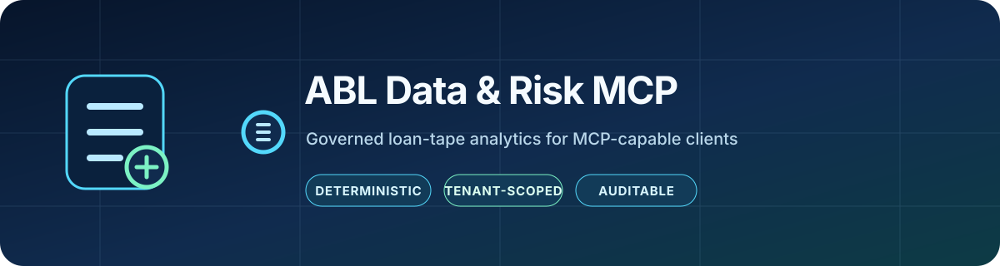
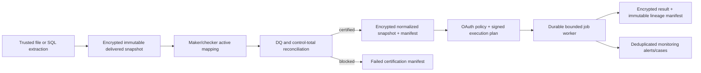

<p align="center">
  
</p>

<h1 align="center">ABL Data &amp; Risk MCP</h1>

<p align="center">
  
  
  
  <a href="./.github/SECURITY.md"></a>
</p>

<p align="center">
  <strong>A governed, model-independent MCP system for asset-based lending and longitudinal loan-tape analytics.</strong>
</p>

<p align="center">
  <a href="#why-this-exists">Why</a> ·
  <a href="#what-is-implemented">Capabilities</a> ·
  <a href="#governed-lifecycle">Architecture</a> ·
  <a href="#quick-start">Quick start</a> ·
  <a href="./docs/SECURITY.md">Security</a> ·
  <a href="./docs/OPERATIONS.md">Operations</a>
</p>

## Why this exists

The product is deliberately narrower than “chat with SQL”:

> An MCP-capable client may express intent, propose a mapping, and explain a result. Trusted deterministic code authenticates, authorizes, maps, validates, calculates, suppresses, reconciles, and records lineage.

Codex, Claude Code, Claude Desktop, and other products can use this server only when the product supplies a compatible MCP client. The underlying language model does not become MCP-compatible by itself, and this repository does not claim compatibility with every model or host.

| Principle | What it means here |
|---|---|
| Governed, not conversational SQL | Models express intent; deterministic services enforce identity, policy, mappings, calculations, suppression, and lineage. |
| Aggregate by default | There is no generic SQL, source-write, raw-row, arbitrary callback, or autonomous credit-decision tool. |
| Reproducible ABL analytics | Exact-decimal stratification, vintage, borrowing-base, DQ, reconciliation, and monitoring run against immutable certified inputs. |
| Portable MCP | One TypeScript server supports Codex, Claude, and other MCP-capable hosts over STDIO or authenticated Streamable HTTP. |

## What is implemented

The repository now contains an end-to-end governed production runtime, a separate local compatibility surface, and an operator-only control plane.

| Surface | Entry point | Purpose |
|---|---|---|
| Governed remote MCP | `node dist/remote-cli.js` | OAuth/OIDC-authenticated Streamable HTTP over `/mcp`; tenant-scoped policy, certified snapshots, durable jobs, results, manifests, and alerts. |
| Local MCP | `node dist/cli.js serve stdio --config ...` | Local STDIO compatibility and development against operator-allowlisted live SQLite/PostgreSQL sources. A loopback-only HTTP mode also exists for development. |
| Operator control plane | `node dist/operator/main.js <command> --request <file>` | Strict, bounded administration for ingestion, SQL snapshot extraction, mappings, definitions, certification, memberships, alert transitions, and audit inspection. It is not an MCP tool surface. |

Implemented foundations include:

- a versioned canonical loan/ABL dictionary and conservative field policy;
- encrypted, content-addressed, write-once delivered, normalized, input, and result artifacts;
- immutable tenant-scoped snapshot, DQ, reconciliation, manifest, replay, and audit records;
- maker/checker lifecycles for mappings, governed definitions, and OAuth tenant memberships;
- bounded CSV, JSON, and NDJSON ingestion plus allowlisted SQLite and PostgreSQL snapshot extraction;
- exact-decimal data-quality checks and control-total reconciliation, including `loan_history` certification through a declared cutoff;
- durable principal-bound jobs authorized by short-lived signed, replay-protected execution plans;
- deterministic snapshot stratification, vintage analysis, AR borrowing-base reperformance, monitoring, durable alert deduplication, and case transitions;
- a remote OAuth/OIDC resource server with exact issuer/audience/resource validation, server-side tenant membership, policy evaluation, Host/Origin controls, rate limits, concurrency limits, liveness, and readiness;
- a hardened Dockerfile, Compose template, Kubernetes base, operator-run release checks, operations guide, and release checklist.

The additive portfolio-platform upgrade also includes versioned source-contract, source-delivery, snapshot-v2, mapping-spec/application, dictionary-v2, certified-population, governed dataset/scope-binding, `SourceAccessPolicyV1`, lifecycle-governed FX-rate definition execution, and data-lineage-only `CertifiedSnapshotPublicationV1` contracts; IDs-only modern capture/certification services and operator schemas; immutable local snapshot/evidence, runtime, publication, and v4 workflow-state repositories; a repository-backed publication verifier; metadata-only portfolio authorization preflight; post-policy least-privilege materialization; standalone v4 governed-operation and dedicated durable-workflow primitives; deterministic portfolio-surveillance and multi-component ABL engines; governed investigation, disclosure-ledger, pipeline, notification, connector, report-signing, adapter-conformance, shared-persistence, and privacy-safe telemetry modules; and a React/TypeScript review console with an OIDC-capable BFF. These upgrade modules are at different integration levels. The exact code-versus-environment status and next integration blockers are tracked in [Upgrade Implementation Status](./docs/UPGRADE_IMPLEMENTATION.md) and [Upgrade Checkpoint](./docs/UPGRADE_CHECKPOINT.md).

There is no generic SQL tool, source-system write, raw-row MCP tool, arbitrary callback/recipient field, or autonomous credit decision.

## Governed lifecycle



A failed certification cannot start governed analytics. Monitoring derives its DQ gate from the certification manifest, never from a caller assertion.

## Remote MCP tools

The production server exposes 17 tools:

- catalog: `abl_capabilities`, `abl_list_dictionary`;
- snapshots: `abl_list_snapshots`, `abl_get_snapshot`;
- mappings: `abl_list_mappings`, `abl_get_mapping`, `abl_propose_mapping`;
- definitions and lineage: `abl_list_definitions`, `abl_get_definition`, `abl_get_manifest`;
- jobs: `abl_start_job`, `abl_get_job_status`, `abl_get_job_result`, `abl_cancel_job`;
- monitoring cases: `abl_list_alerts`, `abl_get_alert`, `abl_transition_alert`.

`abl_start_job` supports `snapshot_stratification`, `snapshot_vintage`, `ar_borrowing_base`, and `monitoring`. Job and result access uses opaque handles bound to the verified principal. Mapping proposals never self-approve or self-activate.

`portfolio_surveillance_v1` has a fail-closed conditional schema and separate delegation seam, but the production `remote-cli` does not inject its dedicated workflow. Production capabilities and `abl_start_job` therefore continue to expose only the four operations above. The repository-backed publication verifier, metadata-only preflight, post-policy materializer, dedicated v4 lifecycle, and modern capture/certification writers are additive foundations, not production enablement. Do not expose the fifth operation until lifecycle-backed source/control/runtime/methodology/dimension/FX authorities, artifact staging, certified production adapters, durable runtime composition, and opaque-handle routing for status/result/cancel are implemented and reviewed.

The local server exposes the original nine direct-source tools plus additive `abl_run_stratification_v2` and `abl_run_vintage_v2` previews. The v2 previews materialize a bounded allowlisted projection and invoke the same deterministic snapshot engines used by governed jobs. They remain local previews, not certification artifacts.

## Quick start

Requirements: Node.js `>=22.13` and pnpm.

```sh
pnpm install --frozen-lockfile
pnpm run verify
pnpm run audit:prod
pnpm run build
```

### Local STDIO

Copy [config/example.json](./config/example.json), keep database credentials outside JSON, then run:

```sh
node dist/cli.js serve stdio --config /absolute/path/to/config.json
```

PostgreSQL URLs are read from the environment variable named by `connectionEnv`. SQLite paths are operator configuration. Neither is accepted in MCP tool arguments.

Codex project configuration:

```toml
[mcp_servers.abl]
command = "node"
args = [
  "/absolute/path/to/SQLProject/dist/cli.js",
  "serve",
  "stdio",
  "--config",
  "/absolute/path/to/SQLProject/config/local.json"
]
required = true
tool_timeout_sec = 60
```

Claude Code or Claude Desktop local configuration:

```json
{
  "mcpServers": {
    "abl": {
      "type": "stdio",
      "command": "node",
      "args": [
        "/absolute/path/to/SQLProject/dist/cli.js",
        "serve",
        "stdio",
        "--config",
        "/absolute/path/to/SQLProject/config/local.json"
      ]
    }
  }
}
```

The local loopback-only development HTTP command is:

```sh
node dist/cli.js serve http --config /absolute/path/to/config.json --host 127.0.0.1 --port 3333
```

Do not expose that unauthenticated launcher through a public bind, tunnel, or reverse proxy.

### Governed remote runtime

The authenticated entry point is:

```sh
node dist/remote-cli.js
```

It has no anonymous or development fallback. `ABL_AUTH_MODE=oauth` and the complete validated runtime contract are required, including `ABL_MCP_PUBLIC_URL`, exact Host/Origin allowlists, OAuth resource/issuer/scopes, control/job/security storage paths, artifact root, policy file, signing and artifact key files, worker settings, and bounded request/job limits. See [Operations](./docs/OPERATIONS.md) for the authoritative setting table and deployment procedure.

### Operator control plane

The operator CLI accepts exactly one command and one bounded JSON request file:

```sh
node dist/operator/main.js --help
node dist/operator/main.js ingest-file --request /secure/requests/ingest.json
node dist/operator/main.js extract-sql --request /secure/requests/extract.json
node dist/operator/main.js certify-snapshot --request /secure/requests/certify.json
```

Current commands are `ingest-file`, `extract-sql`, `extract-sql-v2`, `mapping-propose`, `mapping-transition`, `definition-propose`, `definition-transition`, `definition-v2-propose`, `definition-v2-transition`, `definition-v2-get`, `definition-v2-list`, `definition-v2-select-effective`, `definition-v2-audit-list`, `certify-snapshot`, `certify-snapshot-v2`, `put-input-artifact`, `input-certification-propose`, `input-certification-certify`, `membership-propose`, `membership-approve`, `membership-revoke`, `alerts-list`, `alert-transition`, and `audit-list`. The v2 capture request contains only source-contract and delivery IDs, and the v2 certification request contains only a snapshot ID; both derive actor and output identifiers at the trusted boundary and return redacted metadata. Their runtime ports are optional and unconfigured in the checked-in production runtime. The additive v2 definition commands govern source contracts, source-access policies, mappings, methodologies, borrowing-base policies, surveillance definitions, reports, scenarios, and covenants without mutating v1 records. Their responses are metadata-only: semantic diff paths, impact previews, lifecycle evidence, and integrity hashes are returned, while definition documents and transition evidence are never returned. `definition-v2-select-effective` also verifies the selected version through the durable lifecycle resolver before publishing its execution reference. Raw input artifacts remain inspectable but are not executable; borrowing-base and monitoring jobs require the maker/checker-certified artifact returned by the two input-certification commands and an explicit governed purpose.

The local operator executable is a privileged global-administration boundary. It derives a stable, non-reversible principal ID from the operating-system account; request documents cannot choose actor, proposer, approver, delivery, certification, or transition identities. A `tenantId` in an operator request selects a governed resource—it is not authentication. The current identity design is approved only for one trusted host with distinct, non-reused authorized OS accounts; do not share its control storage across hosts or container UID namespaces. Cross-host administration requires a host- or IdP-bound trusted operator identity. Run maker and checker steps under distinct authorized OS accounts.

Trusted SQL snapshot extraction additionally uses `ABL_OPERATOR_SQL_POLICIES_FILE`. Every policy is bound to exactly one tenant and a dedicated physical table (`tenantIsolation: "dedicated_relation"`, `relationKind: "table"`), and contains opaque dataset/relation/column IDs, validated physical identifiers, exact-text/native encodings, an attested unique order, optional required watermark, and row/column/cell/byte/time limits. Extraction requests cannot contain SQL, credentials, connection strings, filesystem paths, filters, expressions, joins, or URLs.

### Review/admin console

The workspace includes `apps/console`, `apps/bff`, and `apps/contracts`. For the explicitly labeled local fixture experience:

```sh
pnpm run dev:bff
pnpm run dev:console
```

Production mode requires the BFF's OIDC Authorization Code + PKCE configuration, secure HTTP-only sessions, an approved control-API adapter, and TLS. The browser never calls MCP directly and must never receive service credentials. Until the tenant-aware control adapter and durable session backend are wired, the console is a reviewable fixture/conformance surface rather than a deployed administration plane.

## Deterministic analytical semantics

Snapshot stratification uses canonical-field-keyed records, exact decimal arithmetic, explicit validated buckets, stable ordering, fixed execution bounds, totals reconciliation, minimum-cell suppression, and complementary suppression. Restricted identifier-like fields cannot appear in published dimensions or weighted outputs.

Vintage analysis fixes origination cohorts and original-balance denominators, selects a deterministic latest observation per loan/month, returns `null` for unseasoned or unavailable metrics, and rejects conflicting observations or unstable denominators.

The AR borrowing-base engine applies effective-dated eligibility rules, cross-aging, concentration, advance rate, component sublimit, reserves, commitment, defined usage, availability, and overadvance in a deterministic waterfall with exact values and reason-coded steps.

Monitoring evaluates typed, effective-dated decimal or boolean thresholds only after certification. Successful runs persist immutable evidence, deduplicate occurrences into durable alert cases, and support governed acknowledgement, escalation, resolution, suppression, and reopening. Notification delivery remains a separate external concern.

## Deployment assets

- [Dockerfile](./Dockerfile) builds a non-root, read-only production image; its default command remains the safe local STDIO surface.
- [deploy/compose.yaml](./deploy/compose.yaml) explicitly selects `dist/remote-cli.js` under the `remote` profile and binds the published port to loopback.
- [deploy/kubernetes](./deploy/kubernetes) provides a one-replica `Recreate` base with ClusterIP service, persistent control/artifact storage, hardened security contexts, probes, and default-deny networking.
- [docs/OPERATIONS.md](./docs/OPERATIONS.md) defines the operator-run verification, deployment rendering/schema checks, IaC/secret/image scans, SBOM generation, and container smoke checks.

These are reviewed templates and manual verification instructions, not evidence that a public environment has been deployed. This repository intentionally has GitHub Actions disabled.

## Verification

```sh
pnpm run verify
pnpm run verify:integration
pnpm run verify:security
# Run only from a clean, immutable checkpoint:
pnpm run release:verify
```

The fast suite covers protocol-era compatibility, local and authenticated HTTP boundaries, OAuth/JWKS verification, membership and policy reauthorization, immutable/version-guarded stores, encrypted artifacts, replay-protected claim-time plans, bounded worker execution and crash recovery, queue leases/reaping, ingestion and certification, exact domain calculations, disclosure controls, alerts, operator identity, console/BFF behavior, and fake-backed adapter/shared-service behavior. Integration and security orchestration distinguish local conformance evidence from opt-in live environment gates. All verification is operator-run; GitHub Actions remains disabled.

## Honest limits

- PostgreSQL snapshot extraction is implemented and adversarially tested with an injected fake pool, but this repository has not certified it against a live PostgreSQL environment.
- The OCI image has been built, smoke-tested, SBOMed, and scanned locally, but no live cloud deployment, registry promotion/signing, TLS gateway, real IdP, or production restore exercise has been completed here.
- Real Codex CLI exercised tool discovery and `abl_capabilities`; real Claude Code completed its MCP connection health check; the official SDK exercised both legacy and modern protocol eras. Claude Desktop and authenticated remote-client acceptance remain external release gates.
- Recurring scheduling, delivery detection, and notification delivery are intentionally out of process. The runtime has a durable worker for queued jobs, not a calendar scheduler or message dispatcher.
- The durable deployment base uses local SQLite control stores and encrypted filesystem artifacts, so it is one replica with `Recreate`; horizontal scale requires external transactional stores and distributed lease evidence.
- Durable SQLite stores are greenfield/component-registry deployments. An arbitrary pre-registry database is not an approved in-place upgrade source; migrate it offline with an explicitly reviewed, backed-up migration plan (only the documented legacy alert metadata shape has automatic adoption).
- Audit rows are append-only in the local control stores, but export to a separately administered WORM audit system is still an operational integration.
- CSV, JSON, NDJSON, SQLite, and PostgreSQL snapshot extraction are implemented. Hardened XLSX, Parquet, and immutable object-storage preflight/conformance adapters are present, but their production decoder/provider implementations and live certification remain external gates. Snowflake, BigQuery, SQL Server, MySQL, and other adapters are not certified claims.
- The portfolio console currently uses clearly labeled fixture data. Its OIDC-capable BFF and review journeys are implemented, but a live control API, durable session service, tenant-aware administration backend, and deployed IdP remain integration gates.
- The new surveillance, ABL-v2, pipeline, connector, shared PostgreSQL/S3, and analyst-tool modules are not all composed into the production remote runtime yet. They must not be represented as deployed capabilities until the checkpoint integration work is complete.
- New borrowing-base and monitoring jobs require maker/checker-certified, purpose-bound population envelopes that are revalidated at submission and worker execution; monitoring observations must name the exact normalized population they describe. Raw legacy sidecars remain inspection-only. Facility-specific source crosswalks, derived metric-run evidence, and live customer population tie-outs remain production acceptance gates.
- There is intentionally no arbitrary SQL, source write, or raw-row MCP tool.

For deeper design and operating details, see [Architecture](./docs/ARCHITECTURE.md), [Security](./docs/SECURITY.md), [Product Blueprint](./docs/PRODUCT_BLUEPRINT.md), [Roadmap](./docs/ROADMAP.md), [Upgrade Implementation Status](./docs/UPGRADE_IMPLEMENTATION.md), [Upgrade Checkpoint](./docs/UPGRADE_CHECKPOINT.md), [Operator Verification](./docs/OPERATOR_VERIFICATION.md), [Operations](./docs/OPERATIONS.md), and the [Release Checklist](./docs/RELEASE_CHECKLIST.md).
