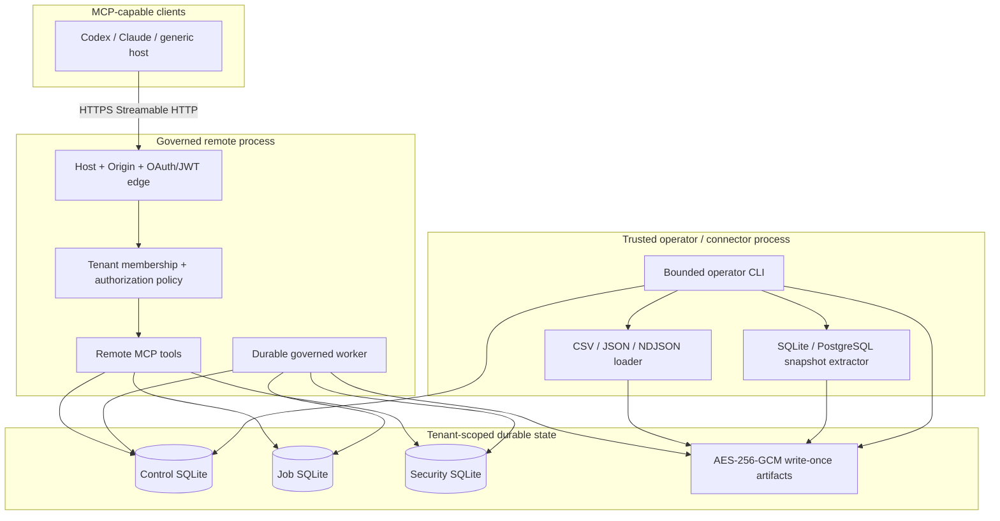

# ABL Data & Risk MCP Architecture

> Status: this document describes the implementation currently in the repository. Deployment templates are not evidence of a live deployment, and PostgreSQL has fake-pool rather than live-database certification.

## Architecture in one sentence

The system separates an OAuth/OIDC-authenticated, tenant-governed remote MCP read plane from a trusted operator ingestion/control plane and a local compatibility server; deterministic services operate on encrypted immutable snapshots and versioned definitions, while durable signed-plan jobs preserve bounded results and lineage.

MCP interoperability belongs to the host or client, not to the language model. Codex, Claude Code, Claude Desktop, or another product can use this server when that product implements a compatible MCP transport and protocol era. There is no technical basis for claiming that every LLM is automatically supported.

## Three executable surfaces

| Surface | Entry point | Transport and audience | Data boundary |
|---|---|---|---|
| Governed remote MCP | `dist/remote-cli.js` | Authenticated Streamable HTTP at `/mcp` | Certified tenant snapshots, governed definitions, durable aggregate jobs/results, and alerts only. |
| Local compatibility MCP | `dist/cli.js` | STDIO by default; optional loopback-only Streamable HTTP | Operator-allowlisted live SQLite/PostgreSQL metadata and aggregate analyses. Not a certified artifact workflow. |
| Operator control plane | `dist/operator/main.js` | One strict JSON-file command per process | Trusted ingestion, certification, governance transitions, membership administration, and audit inspection. Not registered as MCP. |

The local surface retains the original nine direct-source tools, adds deterministic stratification-v2 and vintage-v2 previews, and supports both tested MCP protocol eras. “Legacy” here means the earlier direct-source product surface, not that STDIO is limited to one wire revision. The v2 calls share the governed snapshot-analysis engines but remain previews rather than certification artifacts.

## Runtime topology



The governed remote process validates the non-secret source policy at startup but does not open a live portfolio database. Trusted file/SQL extraction runs through the separately authorized operator topology. This prevents an internet-facing MCP request from carrying connectivity or executable SQL into the source plane.

## Governed data lifecycle

### 1. Delivery and immutable registration

`SnapshotIngestionService` accepts trusted records from the file loader or SQL extraction service. It bounds record and column counts, infers a schema, writes a canonical encrypted `delivered_snapshot` artifact, and registers immutable snapshot metadata in `ControlStore`.

`ArtifactStore` canonicalizes JSON, computes a SHA-256 content hash, derives a tenant-bound content address with HMAC, encrypts using AES-256-GCM with authenticated metadata, and creates the envelope with a write-once filesystem link. Historical keys remain readable during rotation.

### 2. Mapping governance

Mappings contain immutable field payloads plus lifecycle state:

```text
proposed -> validated -> approved -> active -> superseded
```

Validation uses canonical dictionary types and profile requirements. Maker/checker separation is enforced for transitions. Activating a new version atomically supersedes the previous active version for the same mapping key. Mapping proposals exposed through remote MCP cannot approve or activate themselves.

### 3. Definition governance

`DefinitionStore` accepts these strict document kinds:

- `data_quality_profile`;
- `stratification_recipe`;
- `vintage_recipe`;
- `borrowing_base_policy`;
- `monitor_definition`.

Definitions follow `proposed -> validated -> approved -> active`, with effective date selection, supersession, and retirement. Content and identity remain immutable while status transitions are audited. The actor separation rules prevent the proposer from unilaterally validating/approving/activating the same operative definition.

### 4. Data quality, reconciliation, and certification

Certification reloads and authenticates the delivered artifact, applies the active mapping, runs the effective DQ profile, and reconciles declared versus actual row count, exact balance, and currency. It persists:

- the encrypted normalized snapshot artifact;
- immutable DQ run and findings;
- immutable reason-coded reconciliation;
- a certification or failed-certification manifest with hashes and blocker codes.

Point-in-time entities default to exact `as_of_date` equality. `loan_history` defaults to `asOfMode: "through"`: rows may precede the declared cutoff, none may follow it, and the cutoff date itself must be present. Critical/error DQ findings or reconciliation breaks produce a failed manifest; they do not create a caller-overridable “good data” flag.

### 5. Governed execution

The remote `abl_start_job` flow:

1. resolves the verified principal and tenant from OAuth plus the approved membership store;
2. reloads the successful certification manifest, active mapping, normalized artifact metadata, and effective definition versions;
3. evaluates server-owned authorization policy and obligations;
4. fingerprints snapshot, mapping, definitions, optional input artifact, parameters, schema, and policy;
5. durably records the authorization receipt before queue submission and persists only the governed execution envelope—not the bearer token or a reusable execution plan;
6. binds a short-lived opaque job handle to the tenant/principal and enqueues a durable job with three bounded attempts.

At every claim, the worker revalidates credential lifetime and current server-side membership, reloads all governed inputs, reevaluates current policy, issues a fresh short-lived plan for that claim, and atomically consumes its nonce. It then executes the deterministic calculation in a resource-limited worker thread with a hard wall-clock timeout, cancellation polling, and lease heartbeats. A job cannot execute from enqueue-time authorization alone.

The worker checks result row/byte/time obligations, stores an encrypted result artifact, records an immutable analysis manifest and audit, and returns a principal-bound result handle. If a process dies after the immutable artifact and manifest are committed but before queue completion, a later fenced claim verifies and adopts that exact durable result rather than recalculating it. Expired internal result handles can recover a successful result through the immutable manifest while the principal-bound job handle remains valid.

Job status, result, and cancellation calls revalidate live membership and current policy for both the original analysis and the requested action; opaque ownership alone is insufficient. Job, artifact, control, alert, and security stores are durable but are separate stores, not one distributed transaction. Crash windows are handled conservatively by immutable/idempotent records, claim-scoped single-use plans, fenced leases, manifest recovery, and terminal reaping; the current base does not promise a distributed exactly-once transaction.

### 6. Monitoring and cases

Monitoring loads its DQ/publication gate from the certification manifest. A caller cannot claim that the data passed. Typed decimal or boolean observations are evaluated against effective monitor definitions. Successful monitoring persists the run, immutable occurrence evidence, deduplication links, alert recurrence, and case history before the job is marked successful.

Alert states are `open`, `acknowledged`, `escalated`, `resolved`, and `suppressed`; a later recurrence may reopen a resolved case. MCP and operator transitions cannot select arbitrary notification recipients or URLs. External notification delivery is not implemented in this process.

## Deterministic engines

### Snapshot stratification

`runSnapshotStratification` consumes canonical-field-keyed normalized records and immutable lineage hashes. It validates numeric bucket overlap/order and explicit bounds, uses `decimal.js` for monetary and weighted calculations, preserves declared bucket order, adds `Unknown/Unmapped`, reconciles totals, applies minimum-cell and complementary suppression, rejects raw restricted identifier dimensions, and produces a stable result hash.

### Snapshot vintage

`runSnapshotVintageAnalysis` fixes origination cohorts and original-balance denominators, chooses one deterministic latest monthly observation, limits records and points, returns `null` for unseasoned or unavailable metrics, and rejects conflicting duplicates or unstable denominators. Optional loss and delinquency fields are explicitly unavailable rather than silently treated as zero.

### AR borrowing base

The borrowing-base engine selects the effective policy and uses exact decimals. Its implemented waterfall covers record-level eligibility conditions, cross-aging, debtor concentration, advance rate, component sublimit, reserves, commitment, defined usage, borrowing capacity, excess availability, and overadvance. Each stage carries reason-coded evidence and before/after values. It does not infer legal terms; operator-approved policy documents are authoritative.

### Monitoring

The monitor engine validates metric type and unit, selects the effective threshold version, evaluates deterministic comparison operators, and creates stable evidence/deduplication keys. It has no model-calculated threshold path.

## Remote request boundary

`startRemoteHttp` exposes:

- `/healthz` for minimal unauthenticated liveness;
- `/readyz` for minimal unauthenticated readiness;
- OAuth protected-resource metadata at the path derived from `ABL_OAUTH_RESOURCE`;
- authenticated Streamable HTTP MCP at `/mcp`.

The middleware order is exact Host, exact optional Origin, request ID, concurrency gate, bearer authentication, per-principal rate limit, bounded JSON parsing, then MCP dispatch. `trust proxy` is disabled. Tokens are verified against configured HTTPS JWKS endpoints with an exact issuer allowlist, asymmetric algorithm allowlist, audience, resource, required claims, lifetime, and token-type checks. The raw bearer is not retained in SDK context; a non-reversible credential fingerprint is used instead.

Tenant identity is resolved from the fixed maker/checker-governed membership table using issuer, subject, and client identity. Tenant IDs in tool inputs cannot override it. Authorization policy is deny-by-default and can attach exact row/result/time/suppression/audit obligations to a permitted operation.

The remote MCP server exposes 17 tools covering capabilities/dictionary, snapshots, mappings, definitions/manifests, durable jobs, and monitoring alerts. It intentionally registers no MCP resources because the SDK resource catalog cannot apply and durably audit the same per-resource policy at listing time; governed dictionary discovery stays on the authorized tool surface. It returns bounded metadata or aggregate results, never raw normalized rows, artifact storage locators, tokens, credentials, SQL, or source values.

## Local compatibility boundary

`src/cli.ts` builds the original `SourceRegistry` and `buildServer` surface. STDIO is the safe default for a local MCP host. `serve http` is deliberately restricted to `127.0.0.1`, `localhost`, or `::1` and has no OAuth; it is only a development launcher.

The local server exposes live-source catalog tools, mapping suggestion/validation, stratification, and vintage. PostgreSQL aggregate execution uses read-only transactions and timeouts; SQLite opens in read-only mode. These outputs carry live-query fingerprints and warnings, but are not the certified immutable results returned by governed jobs.

Both local transports use the same factory and SDK v2 protocol-era routing. Automated integration tests cover the repository's `legacy-2025` compatibility mode and pinned modern `2026-07-28` mode. Tools are the portable floor; structured results are paired with JSON text fallback. Static dictionary/methodology resources are additive rather than prerequisites.

## Trusted source extraction

### Files

`loadLoanTapeFile` supports bounded UTF-8 CSV, JSON, and NDJSON regular files. It rejects symlinks, unsupported schemas, structured/binary cells, malformed quoting, non-canonical decimal JSON numbers, excessive rows/columns/bytes, and unsafe paths supplied outside the operator request contract. It preserves exact text and never registers a raw-row MCP tool.

### SQLite

`TrustedSqliteSnapshotSource` is constructed from trusted policy and a configured read-only path. It compiles one allowlisted projection with quoted identifiers, required watermark, total unique order, exact-text casts, and `maximumRows + 1`. A worker-thread boundary provides time/cancellation enforcement without exposing database paths to requests.

### PostgreSQL

`TrustedPostgresSnapshotSource` receives an injected `pg.Pool` from trusted operator bootstrap. Each allowlisted source is bound to one tenant and one dedicated physical table; views and materialized views are rejected. It executes a repeatable-read, read-only transaction; applies statement, lock, and idle-in-transaction timeouts; verifies transaction read-only state, table kind, non-owner role, non-superuser status, and `NOBYPASSRLS`; compiles one parameterized projection; asks PostgreSQL to attest row/cell sizes before disclosure; and streams bounded batches through a server-side cursor. Exact-text casts and independent row/column/cell/byte/time checks remain enforced. Abort or timeout destroys the active pool connection.

The PostgreSQL contract is covered with a fake injected pool for SQL compilation, transaction order, cancellation, cleanup, and redacted errors. No live PostgreSQL integration certification is claimed.

## Persistence boundaries

| Store | Current implementation | Important property |
|---|---|---|
| Control | SQLite | Immutable snapshots, DQ/reconciliation/manifests, mapping state, append-only audit, idempotency. |
| Definitions | SQLite tables in the control database | Immutable definition documents, effective status, maker/checker audit. |
| Memberships | SQLite tables in the control database | Fixed issuer/subject/client-to-tenant binding with approval and revocation. |
| Alerts | SQLite tables in the control database | Immutable runs/occurrences, deduplication, mutable case status with append-only transitions. |
| Jobs | Separate SQLite database | Queue, fenced leases, cancellation, idempotency, terminal reaping. |
| Security state | Separate SQLite database | Atomic replay consumption and immutable principal-bound handle mappings. |
| Artifacts | Encrypted filesystem envelopes | Tenant-bound, content-addressed, authenticated, write-once JSON. |

Every SQLite component records its own schema version in a canonical `STRICT` registry. On every open, the runtime attests the exact registered tables, indexes, and triggers by SQLite object type, name, owner table, and canonical DDL; rejects unexpected attached objects and case-insensitive name collisions; and performs initialization or version receipt writes transactionally. An unreceipted pre-existing component object fails closed. Only the fully attested legacy alert schema covered by the migration suite may be adopted automatically.

The supplied deployment therefore uses one replica and `Recreate` with ReadWriteOnce storage. Multiple pods must not open the same SQLite files. Horizontal scale requires transactional shared stores, object storage, distributed lease/replay evidence, and a reviewed migration.

## Components

| Path | Responsibility |
|---|---|
| `src/remote-cli.ts` | Initialize authenticated remote services, durable worker, readiness, and shutdown. |
| `src/transports/remote-http.ts` | OAuth-protected HTTP composition, Host/Origin, rate/concurrency limits, probes. |
| `src/remote-server.ts` | Principal-scoped production MCP tools and authorization/audit calls. |
| `src/operator/main.ts`, `src/operator/cli.ts` | Strict single-command operator entry point. |
| `src/operator/control-plane.ts` | Trusted ingestion/governance orchestration with minimized outputs. |
| `src/control/*` | Durable governance, artifact, job, alert, and audit stores. |
| `src/security/*` | Verified identity, membership, OAuth/JWKS, policy, signed plans/handles, replay state. |
| `src/services/ingestion.ts` | Immutable delivery registration, mapping, DQ/reconciliation, certification. |
| `src/services/governed-workflow.ts` | Signed-plan job orchestration and result lineage. |
| `src/services/snapshot-analysis.ts` | Deterministic snapshot stratification and vintage. |
| `src/domain/borrowing-base.ts` | Effective-dated exact AR borrowing-base waterfall. |
| `src/domain/monitoring.ts` | Typed threshold evaluation and evidence. |
| `src/services/file-ingestion.ts` | Bounded CSV/JSON/NDJSON loaders. |
| `src/services/sql-snapshot-extraction.ts` | Trusted extraction contract and SQLite implementation. |
| `src/services/postgres-snapshot-source.ts` | Injected-pool PostgreSQL immutable snapshot adapter. |
| `src/cli.ts`, `src/server.ts` | Local compatibility server and its nine direct-source tools. |

## Deployment topology

The Docker image defaults to local STDIO and opens no listener. Compose and Kubernetes explicitly select `dist/remote-cli.js` and fail closed if required OAuth, policy, key, or storage configuration is absent.

The Kubernetes base provides a ClusterIP service, one replica, `Recreate`, non-root UID/GID, read-only root filesystem, dropped capabilities, seccomp, no service-account token, persistent control/artifact claims, tmpfs secret staging, probes, and default-deny network policy. It intentionally provides no Ingress, TLS certificate, IdP registration, database, production secrets, or public load balancer.

See [OPERATIONS.md](./OPERATIONS.md) and [RELEASE_CHECKLIST.md](./RELEASE_CHECKLIST.md).

## Current limitations

- No live PostgreSQL certification, database-role inspection against a real server, or production data pilot has been completed.
- No arbitrary SQL, raw-row MCP access, source-system writes, autonomous mapping/rule activation, or autonomous lending decision exists by design.
- Recurring scheduling, delivery detection, and outbound notification delivery are external integrations. The internal worker processes already-queued jobs only.
- Deterministic calculations run in resource-limited worker threads with hard timeouts and cooperative cancellation/lease supervision. Worker termination is process-local isolation, not an operating-system sandbox.
- Durable stores do not share a distributed transaction, and the current SQLite/filesystem base is single-replica.
- Append-only local audit exists; independently administered WORM export is not wired.
- The current working-tree OCI image and deployment assets passed local Docker, SBOM, vulnerability, secret, IaC, Compose, Kustomize, and strict Kubernetes-schema checks; registry promotion, signing/provenance, target-architecture rebuilds, and live cloud deployment remain external gates.
- Automated SDK tests are supplemented by real Codex CLI tool discovery/call and real Claude Code connection-health evidence. Claude Desktop and authenticated remote-client acceptance remain external gates, and every supported client release still needs its own acceptance evidence.
- Only CSV, JSON, NDJSON, SQLite, and PostgreSQL extraction paths exist. Other file/warehouse adapters remain roadmap work.

## Evolution rules

1. Add typed domain operations, never a generic `execute_sql` escape hatch.
2. Keep remote MCP, operator administration, and live source connectivity separate.
3. Require immutable certification before governed analysis or monitoring.
4. Preserve maker/checker activation and effective-dated definitions.
5. Keep calculations exact, deterministic, bounded, suppressed, and lineage-hashed.
6. Keep opaque handles tenant/principal-bound and signed plans replay-protected.
7. Certify every adapter independently against its actual engine before advertising production support.
8. Preserve both protocol-era integration suites and add real-client smoke evidence per supported release.
9. Treat deployment, backup/restore, WORM audit export, IdP/TLS integration, and notification delivery as explicit operating controls—not implied properties of application code.
