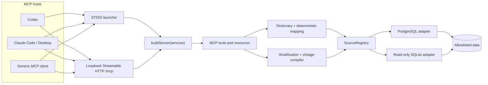

# ABL Data & Risk MCP Architecture

> Implementation status: current repository at server version `0.1.0`. This document describes the code that exists now. Future control-plane, monitoring, borrowing-base, and production deployment concepts belong in [PRODUCT_BLUEPRINT.md](./PRODUCT_BLUEPRINT.md) and are called out here only as limitations or extension points.

## Architecture in one sentence

One transport-neutral TypeScript server factory exposes a conservative, read-only MCP surface; the official MCP TypeScript SDK v2 serves that same factory over STDIO and Streamable HTTP to both 2025-era and 2026-era clients, while deterministic domain code—not the model—maps fields, compiles bounded aggregate SQL, calculates results, and applies disclosure controls.

MCP interoperability is a property of the **LLM host or client**, not of the underlying model. Codex, Claude Code, Claude Desktop, and another product can use this server when that product supplies a compatible MCP client. “Works with all LLMs” therefore means “offers a standards-based, common-denominator MCP contract,” not that every model runtime automatically supports MCP.

## Current decisions

| Concern | Decision in this repository |
|---|---|
| Language and runtime | ESM TypeScript on Node.js `>=22.13`; this keeps the existing mapping and analysis engine in the same type system as the MCP boundary. |
| MCP stack | Official split TypeScript SDK v2 packages pinned exactly to `2.0.0`: `@modelcontextprotocol/server`, `@modelcontextprotocol/client` for tests, `@modelcontextprotocol/node`, and `@modelcontextprotocol/express`. Zod is pinned to `4.4.3`. The workspace also overrides the Node adapter's transitive `@hono/node-server` to patched version `2.1.0`. |
| Server definition | A single `buildServer(services)` factory in [`src/server.ts`](../src/server.ts) registers the surface once. Neither transport owns a second tool implementation. |
| Local transport | STDIO is the primary integration path for local Codex, Claude Code, Claude Desktop, and generic desktop/CLI hosts. |
| HTTP transport | Streamable HTTP is available through a loopback-only development launcher at `/mcp`. It is not currently a remote production service. |
| Protocol strategy | Serve the modern `2026-07-28` era and retain the SDK's legacy 2025 handshake path. Both paths are exercised by integration tests. |
| Portable feature floor | Tools are the source of truth. Static resources are additive. The server does not require prompts, sampling, elicitation, roots, tasks, extensions, or client-specific UI behavior. |
| Database contract | Operator-configured PostgreSQL or SQLite sources, exact schema/table allowlists, restricted-column policy, and fixed aggregate analysis recipes. There is no public arbitrary-SQL or raw-row tool. |
| Authentication | STDIO inherits the local process/OS boundary. The bundled HTTP launcher has no authentication and therefore refuses non-loopback binds. A remote deployment requires a separate authenticated and authorized edge. |

The SDK major and protocol revision are different version axes: “TypeScript SDK v2” is the package generation; `2026-07-28` is the modern MCP protocol revision.

## Runtime topology



[`src/cli.ts`](../src/cli.ts) loads one validated configuration and creates one `SourceRegistry` for the process. The registry lazily creates and caches database adapters. Each MCP server instance is fresh according to its transport lifecycle, but all instances created by that process share the same registry and database pool/handle:

- STDIO pins one factory-created server instance to the connection selected by the opening protocol exchange.
- Modern HTTP creates a server instance per MCP request.
- Legacy HTTP uses the SDK's stateless fallback and also creates a fresh instance per request.
- Shutdown closes the transport handler and then the shared registry.

The factory currently ignores its SDK construction context. It therefore exposes the same surface in both protocol eras and has no per-principal or per-tenant variation.

## One factory, two transports, two protocol eras

### STDIO

[`src/transports/stdio.ts`](../src/transports/stdio.ts) calls:

```ts
serveStdio(() => buildServer(services), { legacy: "serve" });
```

The SDK serving helper owns the opening exchange, selects modern or legacy semantics, and pins the resulting server instance to the connection. Operational messages go to `stderr`; `stdout` remains exclusively MCP protocol traffic. The spawned-process integration test checks this launcher rather than connecting directly to a hand-wired `StdioServerTransport`.

### Streamable HTTP

[`src/transports/http.ts`](../src/transports/http.ts) calls:

```ts
createMcpHandler(() => buildServer(services));
```

The omitted `legacy` option intentionally accepts the SDK v2 default, `legacy: "stateless"`. The handler therefore routes:

- `2026-07-28` envelope traffic to the modern per-request implementation; and
- claim-less/legacy traffic to a fresh stateless legacy server.

The web-standard handler is adapted to Node with `toNodeHandler`, then mounted on an Express app at `/mcp`. `/healthz` reports only that the process is serving; it does not probe database connectivity. `createMcpExpressApp({ host })` supplies JSON parsing plus localhost Host and Origin validation. `startLocalHttp` independently rejects every bind host except `127.0.0.1`, `localhost`, and `::1`.

The legacy HTTP path is deliberately stateless. Legacy GET and DELETE session operations are not supported and receive `405`; clients must not depend on a server-side MCP session. The modern response mode remains the SDK default (`auto`). Current tools emit no related progress or logging messages, so ordinary calls complete as a terminal response rather than requiring an application-managed event stream.

### Protocol support contract

The repository makes and tests two compatibility claims:

| Era | Opening model | Tested client mode | Current status |
|---|---|---|---|
| Legacy | 2025-style `initialize` handshake | Official TS v2 client with `versionNegotiation.mode = "legacy"` | Automated over HTTP and spawned STDIO |
| Modern | `2026-07-28` discovery/envelope protocol | Official TS v2 client pinned to `2026-07-28` | Automated over HTTP and spawned STDIO |

The installed SDK's legacy core contains several historical `2024-*` and `2025-*` revisions. This repository groups the supported fallback as `legacy-2025` and does **not** run one acceptance case per historical revision. Do not claim a particular older revision until it has its own test fixture.

The compatibility rules are:

1. Keep all registrations in `buildServer`; never fork tool definitions by transport.
2. Use `serveStdio(factory)` and `createMcpHandler(factory)`. Directly connecting an `McpServer` to an older transport bypasses the v2 era-routing entry points.
3. Pin the MCP packages exactly and upgrade them together.
4. Treat both protocol-era integration loops as release gates.
5. If a future capability cannot be represented safely in both eras, expose a simpler portable tool contract or explicitly version the capability instead of silently changing semantics.

See the official [MCP versioning specification](https://modelcontextprotocol.io/specification/2026-07-28/basic/versioning) and [TypeScript SDK protocol-version guide](https://ts.sdk.modelcontextprotocol.io/v2/protocol-versions/) for the distinction between the two wire eras.

### Dependency override

[`pnpm-workspace.yaml`](../pnpm-workspace.yaml) contains this deliberate resolution override:

```yaml
overrides:
  "@hono/node-server": 2.1.0
```

`@hono/node-server` is transitive through `@modelcontextprotocol/node`, which supplies the Node adapter used by the HTTP launcher. The override must remain even though the visible web framework is Express: it prevents the locked graph from resolving to a version affected by [GHSA-frvp-7c67-39w9](https://github.com/advisories/GHSA-frvp-7c67-39w9). `pnpm run audit:prod` is a release gate, and an MCP SDK upgrade must re-evaluate—not blindly delete—the override.

## MCP surface and portability policy

### Tools

The factory currently registers nine tools:

| Tool | Boundary |
|---|---|
| `abl_capabilities` | Reports the implemented server, transport, source, and safety posture without credentials. |
| `abl_list_sources` | Lists operator-configured source IDs and allowlists. |
| `abl_list_tables` | Lists only catalog objects that exactly match the source policy. |
| `abl_describe_table` | Returns column names, native types, nullability, ordinals, and restriction flags; never values or database comments. |
| `abl_list_dictionary` | Reads or filters canonical lending definitions. |
| `abl_suggest_mapping` | Produces deterministic, evidence-bearing candidates from non-restricted metadata. A suggestion is not approval. |
| `abl_validate_mapping` | Checks source existence, uniqueness, SQL-type compatibility, and profile coverage. |
| `abl_run_stratification` | Compiles and runs one bounded, aggregate-only stratification for an explicit snapshot date. |
| `abl_run_vintage` | Compiles and runs sparse cohort/month observations from longitudinal snapshots or events. |

Every tool has a strict Zod input schema where it accepts input, an output schema for successful results, and the same annotations:

```json
{
  "readOnlyHint": true,
  "destructiveHint": false,
  "openWorldHint": false
}
```

Annotations help hosts present and approve tools; they are not an authorization boundary. Actual read-only behavior is enforced by the absence of write tools, fixed analysis compilers, allowlist resolution, and database controls.

Successful calls return both:

- `structuredContent`, for clients that consume schema-bound results; and
- a JSON-encoded `text` content block containing the same data, for clients that expose only traditional MCP content.

This dual result is the primary generic-client compatibility mechanism. Stable error results use `isError: true` and a JSON text payload.

### Resources and prompts

Two static resources are registered:

- `abl://dictionary/canonical/1.0.0` — canonical dictionary JSON;
- `abl://methodology/core/v1` — methodology Markdown.

They are useful in clients such as Claude Code that expose MCP resources, but no workflow depends on them. Equivalent operational information remains available through tools and server instructions. There are no resource templates, subscriptions, or list-change notifications.

No MCP prompts are registered. Codex does not need prompt support for the core workflow, while Claude Code can make prompts available as slash commands. Keeping prompts optional prevents a client UX feature from becoming a data or policy dependency.

### Common-denominator capability matrix

| MCP feature | Implemented now | Portability rule |
|---|---:|---|
| Tools | Yes | Required integration surface. |
| Strict input and output schemas | Yes | Keep schemas ordinary JSON objects and bounded arrays. |
| Structured tool results | Yes | Always pair with the JSON text fallback. |
| Tool annotations | Yes | Advisory metadata only. Never use as policy enforcement. |
| Server instructions | Yes | Cross-tool guidance; clients that ignore it must still be safe because code enforces the boundary. |
| Static resources | Yes | Optional enhancement; never required to call a tool correctly. |
| Prompts | No | May be added later only as optional shortcuts. |
| MCP catalog pagination | No custom pagination | Current catalogs are nine tools and two resources. |
| Analysis-result pagination | No | Bounded results either fit or fail with a request-narrowing error. |
| Cancellation | Partial | The server checks the MCP abort signal around work; database calls do not receive that signal. |
| Progress notifications | No | No tool emits progress. |
| Tasks/background work | No | Calls are synchronous request/response operations. |
| Sampling, elicitation, roots, logging | No | The server does not call back into client-specific facilities. |
| Subscriptions/list-changed notifications | No | Tool and resource catalogs are static for the process lifetime. |
| MCP Apps or extensions | No | No UI or extension contract is required. |

MCP catalog cursors and loan-analysis row pages solve different problems. If large result delivery is added, it needs an application-level artifact/handle protocol with authorization, expiry, lineage, and byte limits; MCP `tools/list` pagination is not a substitute.

## Components and dependency boundaries

| Component | Current responsibility | Boundary rule |
|---|---|---|
| [`src/cli.ts`](../src/cli.ts) | Parse `serve stdio|http`, load config, create shared services, and coordinate shutdown. | No MCP tool or SQL semantics. |
| [`src/config.ts`](../src/config.ts) | Validate non-secret source policy and analysis ceilings; resolve relative SQLite paths. | PostgreSQL config names an environment variable, never contains the connection string. |
| [`src/transports/stdio.ts`](../src/transports/stdio.ts) | Bind the shared factory to dual-era STDIO. | Protocol plumbing only. |
| [`src/transports/http.ts`](../src/transports/http.ts) | Bind the shared factory to dual-era HTTP, Node, Express, and loopback safeguards. | No remote auth or tenant logic is implied by this wrapper. |
| [`src/server.ts`](../src/server.ts) | Define server instructions, schemas, tools, resources, public errors, and service orchestration. | No database connection construction and no transport-specific tool behavior. |
| [`src/domain/dictionary.ts`](../src/domain/dictionary.ts) | Versioned canonical field definitions, aliases, logical types, profiles, sensitivity, and analysis tags. | Pure, deterministic domain data and filtering. |
| [`src/domain/mapping.ts`](../src/domain/mapping.ts) | Deterministic candidate scoring and mapping validation. | Works from supplied catalog metadata; never queries a database or asks a model to decide readiness. |
| [`src/services/analysis.ts`](../src/services/analysis.ts) | Resolve canonical mappings, compile fixed stratification/vintage SQL, shape exact-decimal aggregates, suppress cells, and fingerprint mapping/query inputs. | May build only predefined aggregate recipes from resolved metadata. |
| [`src/infrastructure/sql/registry.ts`](../src/infrastructure/sql/registry.ts) | Own source configurations and lazily cache adapters. | Source IDs are the only public connection selector. |
| [`src/infrastructure/sql/postgres.ts`](../src/infrastructure/sql/postgres.ts) | Catalog inspection and aggregate execution through a pool. | Exact allowlists; read-only transaction; statement and lock timeouts. |
| [`src/infrastructure/sql/sqlite.ts`](../src/infrastructure/sql/sqlite.ts) | Read-only local/test adapter using `node:sqlite`. | Opens the configured file read-only and disables extensions. |

Transport code may depend on the factory. The factory may orchestrate domain and infrastructure interfaces. Domain mapping code must not depend on MCP, Express, or a database driver. Analysis code may depend only on the `SqlAdapter` contract, not a concrete driver.

## Governed request flow

### Discovery and mapping

1. The operator starts the process with a validated, non-secret config.
2. The client lists sources and tables; the adapter intersects live catalog objects with exact configured allowlists.
3. The client describes one allowed table. Column names are classified as restricted by explicit configuration and conservative name patterns.
4. The deterministic mapper proposes candidates only for non-restricted columns and returns the evidence behind each score.
5. The validator checks an explicit client-supplied mapping against the dictionary and source metadata for one readiness profile.
6. The mapping remains request data. Nothing is persisted, approved, or activated in the current implementation.

### Analysis

1. The server resolves the source and table again; it does not trust a prior discovery response.
2. Mapping validation must have no blocking errors for the requested profile.
3. The analysis service resolves every requested canonical field to an exact live catalog column and rejects restricted columns.
4. Identifiers are quoted by the adapter; data values are bound as parameters.
5. A fixed aggregate query executes under the adapter's limits.
6. The service converts numeric outputs through `decimal.js`, applies small-cell suppression, and returns warnings and fingerprints.
7. The tool response includes both structured and text forms.

The model expresses intent and may choose among explicit options. It never receives a database credential, submits SQL, fetches raw rows, or performs the authoritative arithmetic.

## Data and security boundaries

### Current local boundary

STDIO is trusted to the same extent as the local host process that starts it. A PostgreSQL connection string is read from the environment variable named by source policy. SQLite paths are operator configuration, not tool arguments. Do not put secrets in MCP tool calls, checked-in config, command arguments, or client-visible source metadata.

The loopback HTTP launcher has no bearer-token or OAuth middleware, no TLS, no principal, no tenant, and no scope evaluation. Its safeguards are intentionally local:

- refusal to bind a non-loopback hostname;
- SDK Express Host and Origin validation for localhost;
- Express's default JSON body limit;
- no public write, raw-row, arbitrary-SQL, file, or callback tool.

Do not expose this launcher through a public bind, tunnel, reverse proxy, or port forward. A production HTTP deployment must put `createAblHttpHandler` behind an OAuth/OIDC resource-server edge and must evolve the factory to consume verified principal/tenant context. Passing an authenticated request through a gateway without making source authorization tenant-aware would provide only an all-or-nothing perimeter, not data isolation. The production design is detailed in [SECURITY.md](./SECURITY.md).

### Database boundary

- PostgreSQL table discovery is limited to configured schemas and then filtered to exact `schema.table` entries. Analysis runs inside `BEGIN READ ONLY`, with a validated statement timeout and a one-second lock timeout. The pool has at most four connections per configured source.
- SQLite is opened with `readOnly: true`, foreign keys enabled, and extension loading disabled. Only the `main` schema can be resolved.
- Source values are normalized before leaving the adapter; binary values are replaced rather than returned.
- Restricted columns are flagged during description, excluded from suggestions, and rejected again when analysis resolves a mapped column.
- Stratification additionally requires a canonical currency balance field, permits only canonical numeric weighted-average fields, and rejects canonical fields marked `restricted` as dimensions or weighted outputs.
- Query result counts are capped. Stratification and vintage ask for one extra row/point and reject over-limit results rather than silently publishing a partial analysis.

These are application controls, not a replacement for a least-privilege database role, PostgreSQL row-level security, a read replica/snapshot, network policy, and database-side resource governance.

## Client configuration examples

Build first:

```sh
pnpm install
pnpm run build
```

Replace `/absolute/path/to/SQLProject` with the checkout path. The examples assume a non-secret policy file at `config/local.json`. If it defines PostgreSQL, the named connection environment variable must be available to the spawned process.

### Codex: local STDIO

Add this to project `.codex/config.toml` or user `~/.codex/config.toml`:

```toml
[mcp_servers.abl]
command = "node"
args = [
  "/absolute/path/to/SQLProject/dist/cli.js",
  "serve",
  "stdio",
  "--config",
  "/absolute/path/to/SQLProject/config/local.json"
]
env_vars = ["ABL_PORTFOLIO_DATABASE_URL"]
required = true
tool_timeout_sec = 60
```

Remove `env_vars` for a SQLite-only config or change the name to the `connectionEnv` declared by the selected source. Codex supports both STDIO and Streamable HTTP and reads server instructions; see the official [Codex MCP documentation](https://developers.openai.com/codex/mcp/).

### Codex: loopback HTTP development

Start the server separately:

```sh
node /absolute/path/to/SQLProject/dist/cli.js serve http \
  --config /absolute/path/to/SQLProject/config/local.json \
  --host 127.0.0.1 \
  --port 3333
```

Then configure:

```toml
[mcp_servers.abl_local_http]
url = "http://127.0.0.1:3333/mcp"
required = true
tool_timeout_sec = 60
```

This URL is unauthenticated and suitable only on the same local machine.

### Claude Code: local STDIO

Project `.mcp.json`:

```json
{
  "mcpServers": {
    "abl": {
      "type": "stdio",
      "command": "node",
      "args": [
        "/absolute/path/to/SQLProject/dist/cli.js",
        "serve",
        "stdio",
        "--config",
        "/absolute/path/to/SQLProject/config/local.json"
      ],
      "env": {
        "ABL_PORTFOLIO_DATABASE_URL": "${ABL_PORTFOLIO_DATABASE_URL}"
      }
    }
  }
}
```

For SQLite, omit `env`. Claude Code also accepts `type: "http"` for Streamable HTTP:

```json
{
  "mcpServers": {
    "abl-local-http": {
      "type": "http",
      "url": "http://127.0.0.1:3333/mcp"
    }
  }
}
```

Claude Code documents HTTP as the preferred remote transport and STDIO for local processes; it also exposes MCP resources and prompts when present. See the official [Claude Code MCP documentation](https://code.claude.com/docs/en/mcp).

### Claude Desktop: local developer configuration

For a direct local development setup, use the STDIO entry in `claude_desktop_config.json`:

```json
{
  "mcpServers": {
    "abl": {
      "type": "stdio",
      "command": "node",
      "args": [
        "/absolute/path/to/SQLProject/dist/cli.js",
        "serve",
        "stdio",
        "--config",
        "/absolute/path/to/SQLProject/config/local.json"
      ]
    }
  }
}
```

Do not paste a database credential into that file. For repeatable distribution, package the server as a Claude Desktop Extension (`.mcpb`) and declare credential fields as sensitive, or provide the spawned process a credential through an approved OS/enterprise mechanism. Claude's current [Desktop Extensions documentation](https://support.claude.com/en/articles/10949351-getting-started-with-local-mcp-servers-on-claude-desktop) describes the preferred installation path.

The bundled loopback HTTP server is not a remote Claude.ai connector: a cloud client cannot reach `127.0.0.1` on the user's machine. Remote connector support requires a separately deployed HTTPS/OAuth service.

### Generic MCP clients

There is no universal client configuration file. A compatible host must either:

- spawn `node .../dist/cli.js serve stdio --config ...` and speak newline-delimited MCP on the child process streams; or
- connect to the Streamable HTTP `/mcp` endpoint.

Use STDIO for a local host and the HTTP handler only behind a production-grade authenticated edge for remote use. A new client is accepted only after the smoke contract below passes; identifying itself as “MCP compatible” is not sufficient evidence.

## Acceptance matrix

The automated tests use the official `@modelcontextprotocol/client@2.0.0`. They prove wire-era and transport behavior, not the UX or policy behavior of every named commercial host.

| Client/path | Era and transport | Evidence in repository | Status |
|---|---|---|---|
| Official TS client → handler | Legacy over Streamable HTTP | [`tests/mcp-integration.test.ts`](../tests/mcp-integration.test.ts) lists tools and runs a stratification with structured and text output. | Automated |
| Official TS client → handler | `2026-07-28` over Streamable HTTP | Same integration loop, pinned modern. | Automated |
| Official TS client → spawned CLI | Legacy over STDIO | [`tests/stdio-integration.test.ts`](../tests/stdio-integration.test.ts) launches the real CLI and calls `abl_capabilities`. | Automated |
| Official TS client → spawned CLI | `2026-07-28` over STDIO | Same spawned-process loop, pinned modern. | Automated |
| Express TCP listener and `/healthz` | HTTP socket | No end-to-end listener test currently exists; HTTP tests invoke the web-standard handler in process. | Pending automation |
| Codex CLI `0.147.0-alpha.6.5` | STDIO and loopback Streamable HTTP | On 2026-08-11 ephemeral, read-only invocations launched or connected to the built server and called `abl_capabilities`, receiving product `ABL Data & Risk MCP` and version `0.1.0`. | Manual smokes passed |
| Claude Code | STDIO and loopback HTTP | Vendor-supported transports and configs are documented, but no Claude Code binary/UI smoke test is in this repository. | Manual acceptance required |
| Claude Desktop | STDIO | Developer config is documented, but no Desktop UI smoke test or `.mcpb` package is in this repository. | Manual acceptance required |
| Any other MCP host | Its supported transport/era | No blanket claim. Run the client smoke contract. | Per-client acceptance required |
| PostgreSQL source | Either transport | Adapter code exists; the repository has no live PostgreSQL integration environment. | Pending certification |

The SDK integration tests are necessary but not sufficient for a release claim. Real Codex CLI STDIO and loopback HTTP smokes are complete, while real Claude Code CLI smokes using operator-style configuration remain an **uncompleted release gate**. Claude Desktop is an additional release gate whenever Desktop support is included in the release scope. Record the exact product version, transport, negotiated era where observable, configuration scope, and smoke results; do not convert a vendor documentation claim into “tested” status.

The minimum smoke contract for a client is:

1. Connect without protocol bytes being polluted by logs.
2. Call `abl_capabilities` and confirm the expected source IDs and safety flags.
3. List all nine tools and call `abl_list_dictionary`.
4. Describe an allowlisted fixture table, suggest a mapping, and validate it.
5. Run a fixture stratification and verify `structuredContent` or its identical JSON text fallback.
6. If the client exposes resources, list and read both static resources. Resource support is not a gate for tool compatibility.
7. Cancel or time out a deliberately slow test call and record both client behavior and database termination behavior.
8. Confirm the host's approval UI treats every operation as read-only, without relying on that UI for enforcement.

## Explicit current limitations

### Transport and protocol

- HTTP is loopback-only, unauthenticated, non-TLS, single-process development infrastructure. OAuth discovery, bearer verification, scopes, tenant resolution, rate limiting, and production CORS/reverse-proxy policy are absent.
- Legacy HTTP is stateless. There are no 2025-style server sessions, resumability, GET event streams, or DELETE session termination.
- The server does not provide the deprecated standalone HTTP+SSE transport, WebSocket transport, or a hosted connector endpoint.
- Only one aggregate legacy mode and the pinned `2026-07-28` mode are tested; historical protocol revisions and real Codex/Claude releases are not each pinned in CI.
- The HTTP handler creates a server per request and retains only process-local registry/pool state. There is no distributed session, event bus, durable job, or horizontal-coordination design.

### MCP behavior

- There are no prompts, resource templates, dynamic tool/resource notifications, subscriptions, progress events, tasks, sampling, elicitation, roots, logging, MCP Apps, or extension capabilities.
- Cancellation is cooperative only at the MCP handler boundary. Tools check the abort signal before and after database work, but `SqlAdapter.executeAggregate` accepts no `AbortSignal`. An abandoned PostgreSQL query can continue until completion or `statement_timeout`; synchronous SQLite work cannot be interrupted and can block the Node event loop.
- There is no result pagination or artifact store. Over-cardinality stratifications and vintages fail and require a narrower request.
- Resources are registered but are not covered by an integration test. Server instructions and annotations are helpful metadata, not controls.

### Identity, policy, and audit

- There is no authenticated principal, tenant, purpose, entitlement, row policy, per-user source filter, or durable audit trail.
- All clients attached to one process see the same configured source IDs and table allowlists.
- The source registry caches one adapter/pool per source and is not partitioned by identity or tenant.
- Mapping and query fingerprints identify inputs, but the live source is explicitly marked `sourceIsImmutableSnapshot: false`. Results are not audit-reproducible certified artifacts.
- There is no snapshot registry, data-quality manifest, recipe registry, result store, lineage graph, policy version, or immutable audit sink.

### Mapping and analysis

- Mapping suggestions are deterministic proposals, not approvals. Mappings are not persisted or versioned and must be supplied again with every analysis call.
- `ready` means “no validation errors.” A mapping with warnings has readiness `needs_review` but can still run because there is no approval workflow.
- Mapping validation currently receives column name/type/nullability but not the column's `restricted` flag. Suggestions exclude restricted fields and analysis execution rejects them, but validation alone can appear ready for a mapping that execution will refuse.
- The `borrowing_base` readiness profile exists in dictionary/mapping metadata, but no borrowing-base calculation tool exists.
- Stratification reconciliation sums the returned group rows and reports a zero difference; it does not execute an independent source control-total query or compare to an immutable tape manifest.
- Vintage analysis assumes repeated snapshots or event history, deduplicates to the latest record per loan/month-on-book, and uses the maximum observed original balance as the cohort denominator. The server cannot prove that the input has the intended grain, full observation history, currency consistency, or immutable cutoff.
- The public surface has no arbitrary SQL, which is intentional. Internally, `executeAggregate` trusts repository code to supply an aggregate query; it is not an AST firewall against a malicious new internal caller.
- SQLite uses dynamic database numerics and a synchronous driver. It is a local fixture/pilot adapter, not a certified exact-decimal production warehouse.
- PostgreSQL code is implemented but has not been certified against a live source in this repository. Database role privileges, RLS, replica status, and network restrictions are deployment responsibilities and are not inspected at startup.
- PostgreSQL enforces a statement timeout, but the common `statementTimeoutMs` setting is not applied by the SQLite adapter.

### Product scope

- Only PostgreSQL and SQLite adapters exist. CSV/XLSX, Parquet, Snowflake, BigQuery, SQL Server, MySQL, and object-store ingestion are not implemented.
- There is no scheduler, automation engine, drift monitor, threshold evaluation, alert delivery, acknowledgement/escalation workflow, or service principal.
- There is no borrowing-base reperformance, eligibility waterfall, reserve/cap engine, covenant calculation, scenario engine, anomaly detector, or portfolio dashboard.
- There is no raw-row preview/export and no source-system write path.
- `/healthz` is liveness only; an empty configuration starts successfully with zero sources, and database credentials/connections are resolved lazily on first use.

## Evolution rules

Changes should preserve these seams:

1. Add domain operations behind typed tools, not a generic `execute_sql` escape hatch.
2. Keep one factory and make transport wrappers thin. If identity-aware serving is added, consume the SDK factory context and construct tenant-scoped services rather than branching tool definitions.
3. Keep tools complete without resources/prompts, and keep successful outputs dual-format.
4. Add immutable snapshots, versioned mapping approvals, policy decisions, and audit evidence before labeling results certified.
5. Add asynchronous jobs only with opaque principal-bound handles, cancellation, progress, expiry, result-size controls, and durable idempotency.
6. Add a production HTTP composition separately from `startLocalHttp`; require HTTPS, OAuth protected-resource metadata, token verification, issuer/audience/resource validation, scopes, tenant authorization, Host/Origin policy, and rate limits before MCP dispatch.
7. Add every new adapter behind the existing `SqlAdapter` boundary, with dialect golden tests, read-only enforcement, timeouts/cancellation, exact numeric behavior, and a live certification environment.
8. Preserve the four transport/era integration tests and add real-host smoke tests for each supported Codex/Claude release train.
9. Run `pnpm run audit:prod` and verify the patched Hono Node adapter resolution on every lockfile or MCP SDK change.

## Authoritative interoperability references

- [MCP `2026-07-28` specification](https://modelcontextprotocol.io/specification/2026-07-28)
- [MCP STDIO transport](https://modelcontextprotocol.io/specification/2026-07-28/basic/transports/stdio)
- [MCP Streamable HTTP transport](https://modelcontextprotocol.io/specification/2026-07-28/basic/transports/streamable-http)
- [MCP authorization specification](https://modelcontextprotocol.io/specification/2026-07-28/basic/authorization)
- [MCP TypeScript SDK v2 server documentation](https://ts.sdk.modelcontextprotocol.io/v2/)
- [Codex MCP documentation](https://developers.openai.com/codex/mcp/)
- [Claude Code MCP documentation](https://code.claude.com/docs/en/mcp)
- [Claude Desktop Extensions documentation](https://support.claude.com/en/articles/10949351-getting-started-with-local-mcp-servers-on-claude-desktop)
