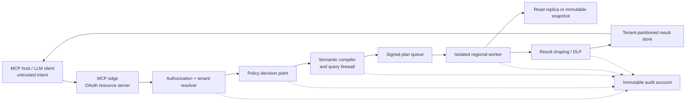

# Security and Trust Model

## Security thesis

Treat this product as a policy-enforced lending analytics gateway that speaks MCP, not as an LLM with database credentials.

The client and model may express intent, suggest field mappings, and request a governed analysis. Only trusted deterministic code may authenticate the caller, resolve the tenant, authorize the tool and dataset, compile an analysis plan, execute it, shape the result, and create the audit record. Tool descriptions, system prompts, annotations, and client confirmation dialogs are usability features; none is a security boundary.

## Non-negotiable invariants

1. Tenant, principal, purpose, and entitlements come only from verified identity and server-side policy, never from a tool argument.
2. A caller cannot widen its allowed schemas, relations, rows, columns, functions, network destinations, or write scope.
3. Runtime database identities cannot modify the source, bypass row policy, assume roles, read server files or secrets, install extensions, or make network calls.
4. Results cannot disclose more sensitive data than policy permits, even when an underlying query produces it.
5. Jobs, handles, caches, queues, result stores, logs, metrics, and errors cannot cross tenant boundaries.
6. Every certified lending metric is reproducible from immutable data plus exact mapping, recipe, compiler, policy, and convention versions.
7. A future write may execute only the exact approved artifact, once, against the expected state.
8. Every decision and data access is auditable without copying raw PII, bearer tokens, credentials, or full result rows into logs.

## Trust boundaries

The control plane owns connectors, dataset registration, field policy, mappings, recipes, approvals, and credentials. The data plane receives a short-lived signed plan and cannot alter control-plane state. A separate audit account receives append-only events.

The repository currently implements a smaller local vertical slice: a shared domain/server factory, local STDIO, loopback-only HTTP, allowlisted database adapters, deterministic mapping, and aggregate analysis. It does **not** yet implement the remote edge, tenant policy engine, signed job plans, result store, or immutable audit sink shown above.

## Current implemented controls

- Sources and tables are operator configured; tool calls accept opaque source IDs and exact table references, never connection strings or credentials.
- PostgreSQL credentials are read from an operator-named environment variable. They are not returned by discovery tools.
- Tables are resolved against explicit schema/table allowlists. Column names are resolved against catalog metadata and safely quoted.
- Restricted columns are rejected before analysis. Table descriptions omit database comments and values.
- There is no generic SQL, raw-row preview, arbitrary file path, URL callback, notification, or write tool.
- Stratification and vintage SQL is compiled from fixed internal recipes with bound values.
- PostgreSQL execution uses an explicit read-only transaction plus statement and lock timeouts. The deployment role must still be independently configured as a non-owner, `NOSUPERUSER`, `NOBYPASSRLS`, SELECT-only role on a replica or warehouse.
- Results are aggregate-only, bounded, and reconciled. Canonical fields classified as restricted cannot be dimensions or weighted outputs; small cohorts are suppressed, and stratification adds complementary suppression when one small cell would otherwise be recoverable by subtraction.
- MCP inputs use strict schemas; result tools return structured output plus a JSON text fallback.
- Local HTTP refuses non-loopback binds and uses the SDK's Host/Origin protections. STDIO writes protocol traffic only to stdout.
- Database and internal errors are converted to stable public errors instead of returning connection details or stack traces.

These controls make the code suitable for local development and a controlled, non-production pilot. They are not a substitute for the production controls below.

## Production request flow

1. The HTTPS edge verifies OAuth/OIDC issuer, audience, resource, expiry, subject, tenant membership, and tool scope on every request.
2. The tenant resolver derives the tenant from verified identity. A model-supplied tenant ID is ignored or rejected.
3. The policy engine returns `DENY`, or `PERMIT` with obligations such as allowed relations/columns, row-filter reference, masks, minimum group size, result and scan limits, timeout, purpose, and policy version.
4. The semantic compiler turns a typed recipe into a canonical relational plan. For advanced analyst SQL, a dialect-aware AST firewall validates the request before compilation.
5. The service signs a plan containing tenant, principal/entitlement fingerprint, dataset and schema fingerprints, recipe/query hash, obligations, expiry, and nonce.
6. A private worker verifies the signature and state, obtains a short-lived tenant/role credential, and runs only the signed plan against a replica or immutable snapshot.
7. An egress gate applies column policy, masking/tokenization, small-cell and complementary suppression, size caps, and sensitivity/lineage labels.
8. The response returns a bounded result or an opaque expiring handle bound to tenant and principal. The audit sink receives the decision and execution metadata.

The MCP access token is never forwarded to a database or downstream service. Internal services use workload identity, and a secret broker mints short-lived database credentials.

## SQL policy

### Default surface

Production defaults should remain typed intent tools such as catalog inspection, mapping validation, data-quality checks, stratification, vintage analysis, borrowing-base reperformance, and monitoring. The server compiles these requests; the model never supplies executable SQL.

### Optional advanced read-only SQL

If `sql.query_readonly` is later added, it belongs behind a separate feature flag and privileged scope. Enforcement must include all of the following:

1. Strict input schema and size limits.
2. An engine-specific parser producing exactly one unambiguous AST. Regex is not a security boundary.
3. SELECT-only semantics; reject DML hidden in CTEs, `SELECT INTO`, copy/export, calls, procedures, pragmas/attach, session mutation, temp objects, DDL/DCL/TCL, and unsupported recursive constructs.
4. Allowlist resolution for every relation, column, function, operator, and type. Reject system catalogs, UDFs, external stages/functions, database links, file functions, and network-capable functions.
5. Bound literals/prepared statements and no string concatenation of user data.
6. Database-enforced RLS/security views and masking in addition to compiler checks. Query rewriting alone is insufficient.
7. Restricted-role `EXPLAIN` preflight without `ANALYZE`, with scan, row, cost, join, and complexity limits.
8. Read-only execution on a replica/snapshot with hard row, byte, cell, time, concurrency, memory, and scanned-byte ceilings plus cancellation.
9. Post-query result-schema validation, DLP, masking, suppression, truncation disclosure, and lineage labels.
10. Stable sanitized error codes; no SQL containing literals, database paths, catalog detail, or stack traces.

No general `execute_sql` or source-system write tool should exist in the public production server.

## Prompt injection and exfiltration

Database names, comments, filenames, headers, cell values, uploaded tapes, and returned URLs are attacker-controlled data. Content such as “ignore prior instructions” or tool-call-shaped JSON must remain inert.

- Expose curated dictionary descriptions rather than raw database comments.
- Put untrusted names and values in typed fields, escape spreadsheet/Markdown/terminal hazards, and never reinterpret them as policy or instructions.
- Do not let result rows alter scopes, tool definitions, destinations, recipients, or follow-on actions; never auto-follow a URL found in data.
- If an LLM proposes mappings, give it no credentials, database tools, or network access. Require structured output, deterministic validation, and human approval before activation.
- Aggregate by default. Any future raw preview requires a separate scope, purpose, masking policy, small bound, and audit event.
- Block packing/encoding operations that could turn denied columns into permitted strings. Apply relation/column policy before execution, not only output masking.
- Executors use default-deny network egress, allowing only the approved database, credential broker/KMS, queue, result store, and telemetry endpoints.

## Tenant isolation and data policy

Preferred isolation tiers, strongest first:

1. separate database/account/warehouse and credential per tenant;
2. separate schema and role per tenant;
3. shared tables only with forced RLS/security policies plus independent server-side checks.

Connection pools must be partitioned by tenant/role or fully reset before reuse. Tenant context is set transaction-locally from verified claims; callers cannot run `SET ROLE` or mutate session policy. Partition encryption keys, object prefixes, queues, caches, quotas, handles, and telemetry by tenant. Cache keys include tenant, principal/entitlement fingerprint, policy version, snapshot, mapping, recipe, and compiler versions.

The canonical dictionary also acts as the field-policy registry. Every field should record sensitivity, direct/quasi-identifier status, permitted purposes/roles, masking/tokenization, aggregation eligibility, retention, residency, and export constraints. Unknown/new fields default to restricted.

For shared or benchmark datasets, use minimum cohorts, complementary-cell suppression, limits on high-dimensional groupings, query-history-aware differencing controls, and—where justified—a formal privacy budget. An authorized client can copy data it is legitimately shown, so minimize disclosure and align model-provider retention and data-boundary settings with the dataset policy.

## Determinism, lineage, and model risk

Every certified output pins the raw content hash, normalized snapshot ID, mapping and approvals, recipe/methodology, compiler, policy, as-of date, timezone, currency/FX source, delinquency/day-count convention, database engine, and rounding/null/negative-balance rules. Calculations use exact decimal arithmetic and stable ordering/tie-breakers. Output artifacts are immutable and content addressed.

Mapping follows `proposed → validated → approved → active → retired`. Schema or distribution drift cannot silently activate a new mapping. Borrowing-base rule versions require maker/checker approval because formula ordering, exclusions, rates, caps, and reserves can materially change availability.

The current live-query implementation returns mapping and query fingerprints plus an explicit warning that the source is not immutable. It must not be presented as an audit-reproducible certified result.

## Writes and change control

The MVP never writes to a customer system of record. The first permissible writes should be narrow internal workflow operations—mapping proposals/approvals and alert acknowledgements—with typed inputs, optimistic concurrency, and idempotency keys.

Any later customer-system write uses a separate service and identity. The proposed change artifact contains the exact target, diff/AST, expected state and row count, validation evidence, rollback, expiry, requester, and cryptographic digest. Approval binds to that digest and expected snapshot. A non-public executor rechecks policy, digest, tenant, expiry, separation of duties, and current state; executes transactionally once; rejects mismatches and replay; and durably records before/after evidence. Writes fail closed when audit evidence cannot be persisted.

## Automation and alerts

Scheduled monitoring jobs use service principals restricted to one tenant, dataset, and recipe plus immutable input watermarks. Changes to mappings, metrics, thresholds, destinations, or policy are versioned and reviewed.

Alert dispatch is a separate service with allowlisted destinations and templates. Database rows cannot supply arbitrary recipients or URLs. Alerts contain minimal PII, carry evidence and run IDs, deduplicate, and record acknowledgement/escalation. A stale or failed quality check blocks publication of a risk signal rather than silently emitting a result from incomplete data.

## Audit and observability

Use one trace/request ID across edge, authorization, policy, compilation, worker, database, result shaping, and approval. Record:

- principal, tenant, client, tool, scopes, purpose, and decision;
- policy, dictionary, snapshot, mapping, recipe, compiler, and schema versions;
- canonical plan/SQL hash with literals redacted, plus relations, columns, and functions accessed;
- estimated and actual rows/bytes/cost, limits, duration, cancellation, and error code;
- masks, suppression, truncation, sensitivity, result digest/handle, database audit ID, and approval chain.

Do not log bearer tokens, credentials, connection strings, raw rows, or full prompts by default. Send events to append-only/WORM storage under a separate security administration boundary with retention and legal-hold policy. Sensitive reads may use a small durable buffer during a telemetry outage and then fail closed; writes fail closed immediately.

## Security verification and release gates

Before a production pilot:

- authorization-matrix tests across tenant, role, scope, tool, dataset, row, column, and purpose;
- cross-tenant canary records, proving no leakage through queries, pooled connections, caches, jobs, handles, logs, errors, or result stores;
- parser/property and dialect fuzzing for any advanced SQL surface;
- prompt-injection corpora in filenames, headers, comments, and cell values;
- exfiltration tests for catalog unions, encoding, errors, timing, differencing, files, DNS/HTTP, UDFs, external stages, and links;
- resource-abuse tests for joins, sorts, windows, regex/JSON, cancellation races, huge inputs, and lock waits;
- RLS/credential inspection proving the runtime role is non-owner, `NOBYPASSRLS`, and free of dangerous predefined roles;
- outage tests for policy, credential broker, KMS, audit, queue, replica, and cancellation paths, with policy uncertainty failing closed;
- golden ABL datasets spanning nulls, duplicates, negative balances, charge-offs/recoveries, restructures, currencies, leap/month-end boundaries, cross-aging, concentrations, reserves, and rule ordering;
- 100% required audit-event coverage and automated scans showing no secrets or raw PII in logs;
- signed builds, SBOM, dependency/container/IaC/secret scans, recovery testing, and an independent tenant-isolation review.

Hard gates are zero unauthorized rows/cells in the adversarial suite, zero executor internet paths, all result handles bound to principal and tenant, deterministic golden hashes, writes impossible with the read-plane identity, and complete audit evidence for every sensitive action.

## Severity guide

- **Critical:** cross-tenant raw PII disclosure; arbitrary source mutation/DDL; credential or control-plane secret theft; SQL-triggered code/network escape; forged write approval; audit-store compromise enabling concealment.
- **High:** same-tenant access to prohibited rows/columns; bulk PII export; masking or small-cell bypass; materially corrupted mapping or borrowing-base policy; job/result handle hijack.
- **Medium:** bounded tenant-scoped denial of service; limited schema leakage; undisclosed staleness/truncation; incomplete attribution for non-sensitive events.
- **Low:** public tool metadata or harmless sanitized error detail without entitlement or data impact.

Assumption: a tenant database administrator controls that tenant's source data, but must not gain control-plane or cross-tenant access. A compromised authorized user can disclose data it is allowed to see; minimization, DLP, client policy, and audit reduce impact but cannot eliminate that fact.

## Authoritative references

- [MCP security best practices](https://modelcontextprotocol.io/docs/2026-07-28/tutorials/security/security_best_practices)
- [MCP authorization specification](https://modelcontextprotocol.io/specification/2026-07-28/basic/authorization)
- [MCP Streamable HTTP transport](https://modelcontextprotocol.io/specification/2026-07-28/basic/transports/streamable-http)
- [PostgreSQL row security](https://www.postgresql.org/docs/current/ddl-rowsecurity.html)
- [PostgreSQL read-only transactions](https://www.postgresql.org/docs/current/sql-set-transaction.html)
