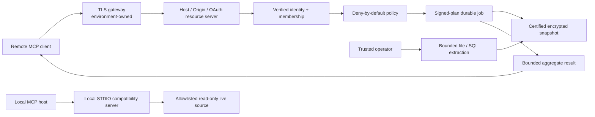

# Security and Trust Model

## Security thesis

Treat the product as a policy-enforced lending analytics gateway that speaks MCP, not as an LLM with database credentials.

An MCP-capable client and its model are untrusted intent producers. Only trusted code may verify identity, resolve tenant membership, authorize an operation, select immutable data and effective definitions, calculate a result, apply disclosure controls, and persist audit evidence. Tool descriptions, prompts, annotations, and client approval dialogs are usability aids—not security boundaries.

## Implemented boundaries

The three boundaries are intentionally different:

- The governed remote runtime is an OAuth resource server and has no live database execution path. It operates on certified durable state.
- The operator runtime has trusted filesystem/database connectivity and is not exposed as an MCP tool surface.
- The local STDIO server is a same-host compatibility/development surface. Its optional HTTP listener is loopback-only and unauthenticated; it must never be promoted as the remote production entry point.

## Non-negotiable invariants

1. Tenant and principal come from verified JWT identity plus server-side approved membership, never a tool argument or unverified token claim.
2. Policy denies by default. A caller cannot widen tools, datasets, fields, rows, result limits, execution time, or disclosure rules.
3. The remote MCP surface cannot accept credentials, connection strings, SQL, paths, URLs, raw rows, source writes, or arbitrary recipients.
4. Governed analysis requires a successful immutable certification manifest, an active mapping, and effective approved definitions.
5. Mapping, definition, and membership activation requires maker/checker separation.
6. Jobs, plans, handles, artifacts, alerts, audit, and results remain tenant- and principal-bound.
7. Signed plans are short-lived, bind exact inputs and obligations, and are consumed once.
8. Certified metrics are deterministic from immutable snapshot, mapping, dictionary, definition, policy, input-artifact, and code hashes.
9. Restricted identifiers and small cells cannot appear in published aggregate results.
10. Logs and public errors must not retain bearer tokens, credentials, secret paths/content, source rows, SQL literals, or nested causes.

## Remote authentication

`startRemoteHttp` accepts requests at `/mcp` only after:

1. exact canonical Host validation against `ABL_MCP_ALLOWED_HOSTS`;
2. exact HTTPS Origin validation against `ABL_MCP_ALLOWED_ORIGINS` when an Origin header is present;
3. a bounded concurrency admission check;
4. strict Bearer parsing and maximum token length enforcement;
5. JWT issuer selection from the configured allowlist—never from an untrusted dynamic discovery decision;
6. asymmetric signature verification through the configured HTTPS JWKS URI;
7. algorithm, token type, required claims, issuer, audience, resource, `iat`, `nbf`, expiry, and maximum lifetime checks;
8. server-side tenant membership resolution for the verified issuer/subject/client tuple;
9. a per-principal rate limit;
10. bounded JSON parsing before MCP dispatch.

HMAC JWT algorithms and `none` are rejected. Remote JWKS retrieval is cached and rotation-aware with bounded timeout/cooldown/cache settings. A raw bearer is never copied into MCP context or durable storage; the code retains only a SHA-256 credential fingerprint where a token-shaped SDK field is unavoidable.

Unauthenticated responses use a token-free RFC 9728 Bearer challenge pointing to protected-resource metadata. `/healthz` and `/readyz` return only minimal status and intentionally do not disclose tenant, source, issuer, or storage details.

The application expects a managed TLS gateway in front of the clear-text container listener. TLS termination, DNS, certificates, public ingress, and IdP client registration are environment controls and are not created by this repository.

## Tenant membership and maker/checker

The fixed `oauth_tenant_memberships` table binds issuer, subject, client ID, tenant ID, and internal principal ID. The mapping cannot be selected by environment variable, token tenant claim, or MCP input.

Memberships follow `proposed -> active -> revoked`. A different actor must approve the proposal. Identity fields are immutable, transitions are idempotent/audited, ambiguous issuer-subject-client tuples fail closed, and revoked/not-yet-valid/expired memberships do not resolve.

Mappings and governed definitions use the same separation principle:

- mapping payloads remain immutable while `proposed -> validated -> approved -> active`; a newly active mapping supersedes the prior active version;
- definition documents remain immutable while `proposed -> validated -> approved -> active`, with effective dates, supersession, and retirement;
- remote MCP can propose a mapping but cannot approve or activate it;
- the operator CLI is the explicit administration boundary for transitions.

## Authorization policy

The remote runtime accepts only a runtime-compiled policy from `ABL_MCP_POLICY_FILE`. It is exact, bounded, versioned, and fingerprinted. Rules select tenant, principal, tool, dataset, purpose, fields, and required scopes. Explicit deny wins; uncovered fields and missing permits/scopes deny.

Permit obligations can only narrow execution. They include:

- maximum result rows and bytes;
- maximum read/analysis execution and pre-commit validation time;
- minimum cohort size;
- immutable-snapshot requirement;
- raw-row and export flags;
- opaque server-owned row-filter references;
- field masks;
- audit tags.

Production startup fails closed unless every configured obligation is implemented end to end. The current remote release requires `allowRawRows=false`, `allowExport=false`, and an empty `fieldMasks` object; row-filter references must be empty or the sole structural marker `tenant-boundary`. Any unsupported default or rule override rejects `ABL_MCP_POLICY_FILE` before the server opens a listener. Result-row, result-byte, read/analysis execution-time, minimum-cohort, immutable-snapshot, and audit-tag obligations remain enforced at their applicable boundaries. `maxResultBytes` covers a successful serialized MCP `tools/call` result after compatibility text, structured content, the modern `resultType`, and SDK server-info metadata are present. The worker reserves that complete outward representation before persisting a result or marking its job successful, and retrieval reevaluates the same projection under current policy. JSON-RPC/HTTP framing and the echoed client-controlled request id are excluded because they add no server-disclosed dataset content. A result that exceeds the cap is replaced by a fixed, data-free error result; production rejects `maxResultBytes` below 1,024 bytes so that the bounded error and every compact mutating acknowledgement remain independently representable. `maxExecutionMs` bounds read/analysis work and validation before a control-plane commit; once an idempotent typed mutation commits, elapsed response time cannot retroactively replace its compact receipt with an error. That receipt remains subject to row and byte limits.

Catalog list operations evaluate and audit policy against each concrete snapshot, mapping, definition, or alert scope before authorized items enter pagination. The governed remote surface exposes dictionary content only through its authorized tool; it registers no MCP resources, so `resources/list` cannot advertise unaudited governed metadata. Cursors and truncation are derived only from that authorized view. Policy decisions and matched rule IDs are appended to audit before tool behavior proceeds.

## Signed plans, replay defense, and handles

A job start creates and durably records a permit decision plus an immutable execution envelope, but it does not persist an enqueue-time plan token. On each fenced worker claim, current credential lifetime, membership, governed inputs, and policy are revalidated before a fresh short-lived HMAC-signed plan binds:

- tenant and pseudonymous principal binding;
- authorization decision, policy ID/version/fingerprint, tool, and dataset;
- operation, requested fields, and obligations;
- parameter, schema, snapshot, mapping, and recipe fingerprints;
- issuance, expiry, key ID, and random nonce.

The plan cannot outlive the verified credential or signing key. The worker atomically inserts a replay record before execution, so a nonce/plan can be consumed only once, including across multiple store instances. A retry receives a newly authorized claim and a new nonce; it cannot reuse an earlier plan.

Opaque job and result handles are separately signed, expire, and resolve only for the same tenant/principal binding. They contain no raw identity or resource locator. Job status, result, and cancel access rechecks live membership and current policy. Governed jobs use three bounded attempts; lease-loss recovery either executes under a fresh claim-time plan or verifies and adopts the already-persisted immutable manifest without recalculation.

Cancellation is durable and idempotent. Queued work can become terminal immediately; running deterministic work is isolated in a resource-limited worker thread that is terminated when cancellation, a hard deadline, or lease loss is observed. PostgreSQL extraction separately destroys the active pool connection on AbortSignal or total-time expiry.

## Snapshot, artifact, and lineage controls

Dataset snapshot rows, DQ runs/findings, reconciliations, manifests, manifest artifact links, replay records, handle bindings, idempotency receipts, and audit events are protected by immutable/append-only database triggers where applicable.

Artifact payloads are:

- canonical JSON;
- bounded by byte limit;
- SHA-256 content hashed;
- tenant-bound and content addressed with HMAC;
- encrypted with AES-256-GCM using a unique 96-bit IV;
- authenticated with identity/type/hash/length metadata as AAD;
- created write-once;
- verified for path identity, authentication tag, length, and content hash on every read.

Delivered source snapshots, normalized snapshots, borrowing-base/monitor inputs, and governed results therefore remain encrypted outside process memory. Artifact metadata returned remotely omits filesystem URIs. Key rotation retains historical decryption/verification keys until retention permits removal.

Certification reloads and authenticates the source artifact, applies only the active mapping, runs the selected active DQ definition, and reconciles exact control totals. A critical/error finding or out-of-tolerance count/balance/currency comparison records a failed manifest. The signed-job loader accepts only a successful `snapshot_certification` manifest and verifies the normalized artifact, snapshot, mapping, and lineage hashes again.

For longitudinal `loan_history`, DQ defaults to through-cutoff semantics: future observations and a missing cutoff observation block publication. This avoids treating a mixed historical population like a single point-in-time tape.

## Analytical disclosure controls

The governed engines do not execute model-generated arithmetic or SQL.

- Exact monetary/rate calculations use `decimal.js` and canonical decimal strings.
- Snapshot stratification validates bucket order/overlap, limits records/groups/columns, rejects restricted identifier dimensions, fails closed when the entire population is below the minimum cohort, and uses primary plus complementary suppression.
- Vintage analysis fixes cohorts and denominators, returns `null` for unseasoned/unavailable metrics, and rejects unstable or conflicting observations.
- Borrowing-base reperformance uses an effective-dated, operator-approved policy and returns reason-coded exact waterfall steps.
- Monitoring uses typed effective definitions and derives publication eligibility from the certified manifest, never a caller claim.
- Result artifacts and manifests bind all inputs and hashes; public tools return only bounded aggregates/metadata.

The server does not currently implement query-history-aware differencing protection or a formal privacy budget. Minimum cohorts, complementary suppression, field policy, bounded dimensions, and policy limits are the present controls; a high-sensitivity shared benchmark deployment would need additional privacy analysis.

## Source and ingestion security

File ingestion accepts only bounded regular UTF-8 CSV/JSON/NDJSON files through the operator boundary. It rejects symlinks, malformed encodings/quoting, unsupported structures, excessive bytes/rows/columns, and unsafe non-scalar values. Paths never enter an MCP tool call.

SQLite extraction opens trusted configured files read-only, disables extension loading, validates allowlisted identifiers/columns, uses a deterministic unique order and optional required watermark, and enforces execution bounds in a worker thread.

PostgreSQL extraction accepts an injected pool only from trusted operator bootstrap. Requests contain opaque IDs—not SQL or connectivity. The adapter:

- binds every allowlisted relation to exactly one tenant with `dedicated_relation` isolation and accepts physical tables only;
- validates and quotes allowlisted schema/table/column identifiers;
- binds watermark and limit parameters;
- casts `exact_text` fields to text;
- requires a trusted unique total order;
- executes `REPEATABLE READ READ ONLY`;
- applies statement, lock, and idle-in-transaction timeouts;
- verifies transaction read-only state, table kind, non-membership in the owner role, non-superuser status, and `NOBYPASSRLS`;
- performs server-side row/cell size attestation, then reads bounded cursor batches with independent row/column/cell/byte limits;
- destroys the connection on abort/timeout;
- maps database failures to stable redacted error codes.

Deployment must still independently prove the role cannot assume dangerous roles, has SELECT-only grants, and is constrained by network/database resource policy. Current PostgreSQL tests use a fake pool; no live role, RLS, or cursor integration certification is claimed.

## Prompt injection and exfiltration

Filenames, headers, table/column names, cell values, mapping evidence, definition text, and alert messages are untrusted data. They must remain typed data, never instructions or authority.

- Raw database comments and source values are not exposed through the remote catalog.
- Tool schemas are closed-world and bounded.
- Unknown canonical fields default to restricted.
- Models cannot submit SQL, credentials, paths, network destinations, recipients, JavaScript, or Python.
- A mapping suggestion is evidence, not approval.
- Monitoring evidence cannot create an arbitrary outbound message.
- Stable errors discard nested causes and sensitive source details.
- MCP compatibility text is prefixed `UNTRUSTED_DATA_JSON:`; structured content remains authoritative, and returned strings never become policy or instructions.
- Application logs must not contain bearer headers, prompts, raw artifacts, connection strings, or full tool bodies.

## Audit and persistence

The application records durable tenant-scoped events for authorization, governance transitions, certification, job lifecycle, analysis manifests, membership changes, monitoring occurrences, and alert transitions. Audit payloads use IDs, fingerprints, reason codes, limits, outcomes, and lineage rather than raw records or tokens.

The supplied runtime uses three SQLite database files plus encrypted filesystem artifacts. It requires one replica and application-consistent backup of SQLite main/WAL/SHM files and artifacts at one recovery point. A plain copy of only a live main database file is not a valid backup.

Every durable SQLite component uses a canonical `STRICT` schema registry and re-attests all registered tables, indexes, and triggers on every open. Attestation includes object type, owner table, case-insensitive SQLite identity, and canonical DDL; unreceipted objects, unexpected attached triggers/indexes, name collisions, tampering, partial initialization, and unsupported newer versions fail closed. Arbitrary pre-registry databases require an offline reviewed migration rather than silent adoption.

Local append-only triggers protect audit rows from ordinary update/delete, but this is not a separately administered WORM system. Production operation still requires authenticated audit export, retention/legal-hold policy, monitoring, restore rehearsal, and an administration boundary separate from application operators.

The job, control, security, alert, and artifact stores do not participate in one distributed transaction. Authorization receipts are written before queue admission; every claim rechecks current membership and policy and consumes a fresh single-use plan. The design uses immutable/idempotent writes, fenced leases with heartbeats, hard worker deadlines, verified manifest recovery, and terminal reaping to fail conservatively across crash windows; it does not promise a distributed exactly-once transaction.

## Deployment controls

The final image is a shell-free distroless Node.js runtime running as numeric non-root UID/GID 65532 and is compatible with a read-only root filesystem. A small Node entrypoint stages owner-only secrets and selects the authenticated remote module; there is no runtime package manager or shell. The Kubernetes base drops capabilities, uses `no-new-privileges` and runtime-default seccomp, disables service-account-token mounting, stages owner-only secret copies in tmpfs, uses a ClusterIP service, and supplies default-deny network policy.

The templates intentionally do not create public ingress, TLS, DNS, certificates, IdP registration, production secrets, database egress, signed image promotion, or backup schedules. A bridge network is not an egress firewall. Follow [OPERATIONS.md](./OPERATIONS.md) and [RELEASE_CHECKLIST.md](./RELEASE_CHECKLIST.md).

## Writes and automation

There are narrow internal control-plane writes: mapping/definition/membership proposals and transitions, durable job state, certification records, alert cases, and audit. They use strict schemas, idempotency, state transitions, and maker/checker rules where authority changes.

There is no customer source-system write path. Any future source write needs a separate identity/service, exact approved change artifact, expected-state binding, replay prevention, transactional execution, rollback evidence, and fail-closed audit.

The runtime worker processes already queued jobs. Recurring scheduling, delivery/watermark detection, source connector invocation, and outbound notification delivery remain external. Destinations must be allowlisted by a separate dispatcher; source rows and model text must never select recipients or URLs.

## Verification and known gaps

Automated tests cover OAuth/JWKS validation and rotation, live tenant-membership revocation, current-policy job access, cross-principal handles, deny-by-default policy, claim-time signed-plan tamper/expiry/replay, encrypted artifact integrity and rotation, immutable/versioned stores, worker deadlines, queue fencing/reaping/cancellation/crash recovery, DQ/reconciliation gates, exact analyses and disclosure bounds, alert deduplication/transitions, operator identity, request redaction, Host/Origin, rate/concurrency limits, both supported protocol eras, and fake-pool PostgreSQL cursor/cancellation/cleanup.

The following are not completed evidence:

- a live PostgreSQL role/RLS/precision/cancellation certification;
- a real IdP/TLS gateway and cross-tenant staging deployment;
- exact-commit OCI build/runtime, SBOM, vulnerability, secret, IaC, and schema evidence; registry promotion, signing/provenance, target-architecture rebuilds, and live Compose/Kubernetes/cloud deployment;
- image signing/provenance/registry promotion;
- application-consistent restore and measured RPO/RTO;
- external WORM audit export;
- external scheduler and notification dispatcher;
- authenticated real remote-client and Claude Desktop smoke tests (real Codex CLI tool use and Claude Code connection health are complete).

These gaps block a claim of live production deployment even though the governed runtime and deployment assets are implemented.

## Severity guide

- **Critical:** cross-tenant raw data disclosure; arbitrary source mutation; credential/key theft; forged authorization or signed-plan execution; SQL-triggered code/network escape.
- **High:** same-tenant prohibited field disclosure; raw bulk export; suppression bypass; handle hijack; materially unauthorized mapping/policy activation or borrowing-base result.
- **Medium:** bounded tenant-scoped denial of service; limited metadata leakage; incomplete non-sensitive attribution; undisclosed staleness/truncation.
- **Low:** public tool metadata or sanitized error detail without entitlement/data impact.
